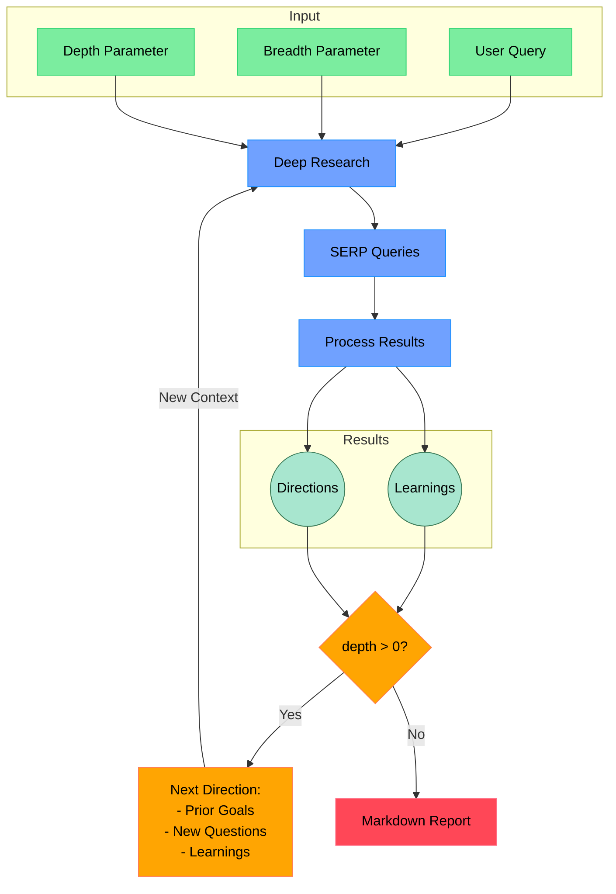

# Open Deep Research

An AI-powered research assistant that performs iterative, deep research on any topic by combining search engines, web scraping, and large language models.

The goal of this repo is to provide the simplest implementation of a deep research agent - e.g. an agent that can refine its research direction over time and deep dive into a topic. Goal is to keep the repo size at <500 LoC so it is easy to understand and build on top of.

If you like this project, please consider starring it and giving me a follow on [X/Twitter](https://x.com/dzhng). This project is sponsored by [Aomni](https://aomni.com).

## How It Works


# Deep-Research API 사용 및 프로젝트 구조 안내

이 저장소는 **Deep-Research**라는 AI 기반 심층 연구(리서치) 수행 시스템의 Node.js API 서버 예시 구현체를 포함하고 있습니다. 검색 엔진, 웹 스크래핑(Firecrawl), 대규모 언어모델(LLM)을 결합하여 특정 주제에 대해 반복적이고 단계적인 리서치를 진행하고, 그 결과물을 마크다운 리포트, 로그, 액션플랜 등으로 산출합니다.

본 문서는 이 코드베이스(deep-research)의 구조, 주요 파일 설명, 실행 방법 및 API 사용 방법을 안내합니다.

---

## 주요 특징

- **단계적(Auto/Iterative) 연구**: 사용자가 입력한 Query를 기반으로, 일정한 Breadth/Depth만큼 검색(웹스크래핑) + LLM 분석을 반복하여 주어진 주제에 대한 정보를 재귀적으로 수집하고 요약.
- **결과물 자동 생성**: 
  - 최종 마크다운 리포트(`.md`)  
  - 연구 로그(`.txt`)  
  - 액션 플랜(`.json`)  
- **REST API**: Node.js(Express) 서버를 통해 REST 엔드포인트를 제공. 새로운 리서치 작업을 생성하고, 진행 상태를 폴링하며, 최종 산출물을 다운로드 가능.
- **간단한 구조**: `<500 LoC`를 목표로 하여 코드를 쉽게 이해하고 확장할 수 있도록 구성.

---

## 프로젝트 구조

```
larry1121-deep-research/
├── README.md
├── action_plan.json
├── docker-compose.yml
├── Dockerfile
├── LICENSE
├── package.json
├── prettier.config.mjs
├── tsconfig.json
├── .nvmrc
├── .prettierignore
└── src/
    ├── api.ts                // 메인 Express API 엔드포인트
    ├── deep-research.ts      // 재귀적 연구(딥서치) 로직
    ├── feedback.ts           // 추가 정보(neededInfo) 생성용 로직
    ├── index.ts              // runResearch() 등 최상위 함수
    ├── output-manager.ts     // 로그/진행상황 출력 및 파일 관리
    ├── progress-manager.ts   // (참고) 콘솔 Progress Bar 기능
    ├── prompt.ts             // systemPrompt 등 프롬프트 템플릿
    ├── run.ts                // CLI 인터페이스 (질문→응답)
    └── ai/
        ├── providers.ts      // OpenAI(LangChain) 등 모델/토큰 처리
        ├── text-splitter.test.ts
        └── text-splitter.ts  // 텍스트 스플릿 로직 (대용량 텍스트 분할)
```

> `final_report_*.md`, `research_log_*.txt`, `action_plan.json` 등은 실제 리서치를 실행했을 때 자동으로 생성된 산출 예시 파일입니다.

---

## 사전 준비

### 1) 환경 변수 설정

- `.env.local` 파일을 생성하여 아래와 같은 형식으로 API 키를 기입해야 합니다.
- 예시:

```bash
FIRECRAWL_KEY="your_firecrawl_key"
OPENAI_KEY="your_openai_key"
OPENAI_ENDPOINT="https://api.openai.com/v1"   # (선택) 커스텀 엔드포인트
```

- **FIRECRAWL**: Firecrawl 웹 검색/스크래핑 API 키  
- **OPENAI**: OpenAI API 키 (또는 자가 호스팅 LLM 환경에 맞춰 설정)

### 2) Node.js 버전

- `.nvmrc`에 `v22`로 명시되어 있으므로, Node.js 22.x 버전을 권장합니다.
- `npm install` 후, 필요 라이브러리가 모두 설치됩니다.

---

## 실행 방법

### 1) 로컬에서 직접 실행

```bash
git clone https://github.com/larry1121-deep-research.git
cd deep-research
npm install
npm start
```

- 서버가 기본적으로 `localhost:3000` 포트에서 실행됩니다.
- `npm start` 스크립트는 내부적으로 `tsx --env-file=.env.local src/run.ts`를 통해 리서치 CLI를 띄우게 됩니다.  
- **API 서버**만 구동하고 싶다면: `npm run api` ( → `src/api.ts` )  

### 2) Docker Compose로 실행

- **Dockerfile** + **docker-compose.yml**를 통해 컨테이너화 가능

```bash
docker compose up -d
# deep-research라는 이름의 컨테이너가 올라옴
```

- 이후 `docker logs -f deep-research` 등을 통해 로그를 확인할 수 있습니다.
- 컨테이너 내부에서 `npm run docker` 커맨드로 서버가 실행되며, 3000번 포트에서 REST API를 제공합니다.

---

## 사용 예시 (REST API)

### 1) 리서치 작업 생성 (POST `/api/research`)

```bash
POST /api/research
Content-Type: application/json

{
  "query": "타로 카드 크라우드펀딩 성공시키기",
  "breadth": 3,
  "depth": 2
}
```

- 응답 예시:

```json
{
  "jobId": "123e4567-e89b-12d3-a456-426614174000",
  "message": "Research job started",
  "status": "pending"
}
```

- `jobId`를 이용하여 이후 상태 조회, 결과 다운로드 가능.

### 2) 진행 상태 조회 (GET `/api/research/:jobId`)

```bash
GET /api/research/123e4567-e89b-12d3-a456-426614174000
```

- 응답 예시(진행 중):

```json
{
  "jobId": "123e4567-e89b-12d3-a456-426614174000",
  "status": "running",
  "progress": {
    "currentDepth": 1,
    "totalDepth": 2,
    "currentBreadth": 3,
    "totalBreadth": 3,
    "currentQuery": "AI SaaS fundraising and exit case studies success stories",
    "totalQueries": 3,
    "completedQueries": 1
  },
  "createdAt": "2025-03-21T04:24:42.757Z",
  "updatedAt": "2025-03-21T04:25:18.354Z"
}
```

- 응답 예시(완료 후):

```json
{
  "jobId": "123e4567-e89b-12d3-a456-426614174000",
  "status": "completed",
  "progress": {...},
  "result": {
    "learnings": [...],
    "visitedUrls": [...],
    "reportPath": "./results/123e4567.../final_report_...",
    "logPath": "./results/123e4567.../research_log_...",
    "actionPlanPath": "./results/123e4567.../action_plan_...",
    "report": "...(string)...",
    "actionPlan": {...}
  }
}
```

### 3) 최종 산출물 다운로드

- 보고서(Markdown): `GET /api/research/:jobId/report`
- 로그(Text): `GET /api/research/:jobId/log`
- 액션플랜(JSON): `GET /api/research/:jobId/action-plan`

```bash
# 예: 보고서 다운로드
curl -LO http://localhost:3000/api/research/123e4567-e89b-12d3-a456-426614174000/report
```

---

## 코드 구성 상세

### `src/api.ts`

- Express 기반 REST API 서버
- 주요 엔드포인트:
  - `POST /api/research`: 연구 작업 생성
  - `GET /api/research/:jobId`: 작업 상태 조회
  - `GET /api/research/:jobId/report`: 최종 마크다운 보고서 다운로드
  - `GET /api/research/:jobId/log`: 리서치 로그 파일 다운로드
  - `GET /api/research/:jobId/action-plan`: 액션플랜(JSON) 다운로드
- **작업 상태 관리(`jobs: Map<string, JobStatus>`)**:
  - 상태: `pending` → `running` → `completed` (or `failed`)
  - 작업 시작 시, 비동기로 `runResearch()`를 호출하고 진행 상황을 `progress`에 저장

### `src/index.ts` & `src/run.ts`

- **`runResearch()`**: 딥리서치를 수행하는 메인 함수
  - `deepResearch()` 호출 → 학습 결과(learnings, visitedUrls) 수집 → 최종 보고서·액션플랜 생성
  - 결과물 파일(`final_report_*.md`, `action_plan_*.json`)을 지정된 경로에 저장
- **`src/run.ts`**: CLI 인터페이스
  - Node CLI로 프로젝트를 실행 시, 사용자에게 `Query`, `Breadth`, `Depth` 등을 입력받아 리서치를 진행
  - 완료 후 `final_report_*.md`를 출력

### `src/deep-research.ts`

- **핵심 로직**: 재귀적(Recursive)으로 검색 및 LLM 분석을 수행
- `deepResearch({ query, breadth, depth })` 프로세스:
  1. `generateSerpQueries()`를 통해 주제(Query)를 세분화할 검색 쿼리들 생성
  2. Firecrawl로 검색(동시성 제한 `ConcurrencyLimit=3`) 후, 마크다운 데이터 분석
  3. LLM으로부터 `learnings`(학습 포인트)와 `followUpQuestions`(추가 조사 질문) 추출
  4. Depth>0이면, `followUpQuestions`를 기반으로 재귀 호출(=더 깊은 조사)
  5. 최종적으로 수집된 `learnings`와 `visitedUrls`를 리턴
- **`writeFinalReport()`**, **`writeActionPlan()`**: 리서치 결과(learnings)를 종합하여 마크다운 보고서와 JSON 액션플랜을 작성

### `src/output-manager.ts`

- 리서치 진행 상태(Progress)를 로그 파일에 남기고, 콘솔에도 표시하는 클래스
- `log()` 메서드로 파일쓰기 + 콘솔출력
- `updateProgress()`는 바 형태의 진행 상황을 로그에 기록

### `src/ai/`

- **`providers.ts`**: 
  - OpenAI provider 설정, `o3MiniModel` 등 모델 래퍼
  - 토큰 인코더(`js-tiktoken`)로 prompt 길이 검사, `trimPrompt()`로 초과분 제거
- **`text-splitter.ts`**: 
  - 대용량 텍스트를 chunk로 나누는 유틸 (재귀적 스플릿)
  - LLM 컨텍스트 제한을 넘지 않도록 텍스트 분할

---

## 커스텀 및 확장 포인트

1. **LLM 변경**: 
   - `src/ai/providers.ts`에서 OpenAI 모델(`o3MiniModel`)을 다른 API나 로컬 모델로 교체 가능.
2. **검색 엔진 커스터마이징**: 
   - Firecrawl 외에도 다른 검색/스크래핑 API를 연동하거나, 사내 DB/ES로 대체 가능.
3. **에러 처리/재시도 로직**: 
   - 현재는 단순히 `try/catch` 후 상태 `failed` 설정에 그치므로, 재시도나 타임아웃 전략을 추가 가능.
4. **결과물 포맷**: 
   - 보고서를 PDF 등 다른 형태로 변환하거나, 액션플랜을 외부 협업 툴로 자동 전송 가능.
5. **서드파티 연동**: 
   - 슬랙/이메일 알림, CI/CD 등과 연결하여 리서치 완료 시 알림 전송 등 확장 가능.

---

## 자주 묻는 질문 (FAQ)

1. **Q: Breadth와 Depth는 무엇인가요?**  
   - _Breadth_: 1회차 검색 시 병렬적으로 몇 개의 쿼리를 생성할지 결정  
   - _Depth_: 검색 후 LLM 분석을 통해 추가 질문(followUpQuestions)이 생기면, 그만큼 더 깊이 반복할 단계 수
2. **Q: Firecrawl 제한이나 요금 문제는 없나요?**  
   - Firecrawl 무료 플랜 사용 시, 동시성이나 검색 횟수에 제한이 있습니다. 대량 검색 시 주의하세요.
3. **Q: 클라이언트 측에서는 어떻게 API를 활용하나요?**  
   - 본 저장소에 `api.ts`가 제공하는 REST 엔드포인트를 통해 POST로 리서치를 발행하고, GET으로 상태와 결과물을 수신하면 됩니다.  
4. **Q: Node 대신 Docker만 사용해도 되나요?**  
   - 네, `docker-compose.yml`로 Node 컨테이너를 띄울 수 있으며, 단 `.env.local` 등 환경 변수를 적절히 연결해야 합니다.

---

## 라이선스

- [MIT License](./LICENSE)

본 프로젝트는 자유롭게 포크/수정/배포하실 수 있습니다.  

---

## 기여

- 버그, 제안 사항, PR은 언제나 환영합니다.  
- 실제 프로젝트 운영 시에는 API rate limit, 에러처리, 보안(인증/인가) 등을 추가로 구현하시길 권장합니다.

감사합니다!  
**Open Deep Research**와 함께 AI 기반 심층 리서치를 간편하게 수행해 보세요.
