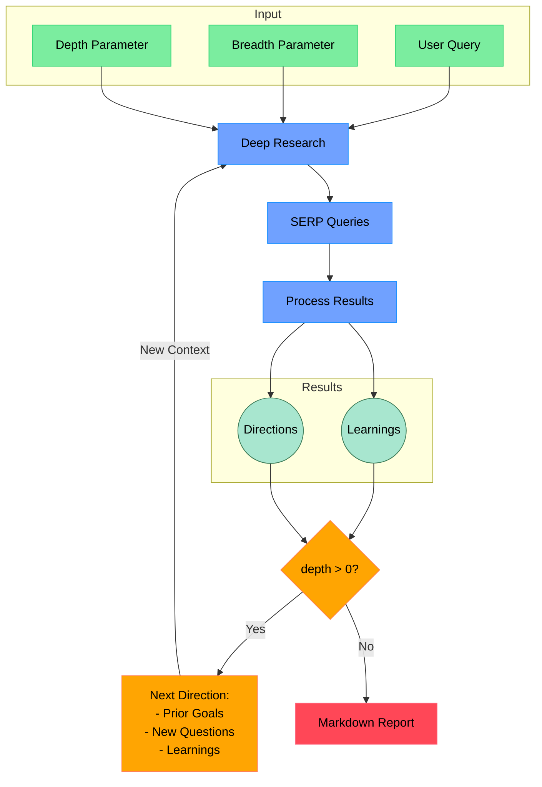

# Open Deep Research

An AI-powered research assistant that performs iterative, deep research on any topic by combining search engines, web scraping, and large language models.

The goal of this repo is to provide the simplest implementation of a deep research agent - e.g. an agent that can refine its research direction over time and deep dive into a topic. Goal is to keep the repo size at <500 LoC so it is easy to understand and build on top of.

If you like this project, please consider starring it and giving me a follow on [X/Twitter](https://x.com/dzhng). This project is sponsored by [Aomni](https://aomni.com).

## How It Works



# Deep-Research Go 클라이언트 사용 가이드

이 저장소는 **Deep-Research** 시스템을 Go 코드에서 쉽게 연동하기 위한 예시 클라이언트(`deepresearch_client.go`)와 사용 예시(`example_usage.go`)를 제공합니다. Go 언어 기반의 애플리케이션에서 Deep-Research API를 호출하고, 연구(리서치) 작업을 생성 및 모니터링하며, 결과 리포트·로그·액션플랜을 손쉽게 다운로드할 수 있도록 구성되어 있습니다.

---

## 개요

- **Deep-Research**는 검색(검색 엔진, 웹 스크래핑)과 LLM(Large Language Model)을 결합하여 특정 주제에 대해 단계적이고 심층적인 AI 리서치를 수행하는 시스템입니다.
- 이 저장소에는 Node.js 기반으로 Deep-Research 에이전트를 실행하고(서버로 동작), 이후 Go 언어를 사용하는 클라이언트(`deepresearch_client.go`)로 해당 서버의 API를 호출하여 리서치 작업을 제어할 수 있는 예시가 포함되어 있습니다.
- 예시 프로젝트 구조:
  ```
  larry1121-deep-research/
  ├── README.md
  ├── action_plan.json
  ├── deepresearch_client.go      <-- Go 클라이언트 예시 (중요)
  ├── docker-compose.yml
  ├── Dockerfile
  ├── example_usage.go            <-- Go 사용 예시
  ├── final_report.md
  ├── final_report_2025-03-21T04-24-16-187Z.md
  ├── LICENSE
  ├── package.json
  ├── prettier.config.mjs
  ├── report.md
  ├── research_log_2025-03-21T04-24-16-187Z_2025-03-21T04-24-16.187Z.txt
  ├── research_log_2025-03-21T04-24-16.183Z.txt
  ├── tsconfig.json
  ├── .nvmrc
  ├── .prettierignore
  └── src/
      ├── api.ts
      ├── deep-research.ts
      ├── feedback.ts
      ├── index.ts
      ├── output-manager.ts
      ├── progress-manager.ts
      ├── prompt.ts
      ├── run.ts
      └── ai/
          ├── providers.ts
          ├── text-splitter.test.ts
          └── text-splitter.ts
  ```

---

## 사전 준비

### 1) Node.js 서버 실행 (Deep-Research API)

1. **저장소 클론 및 의존성 설치**
   ```bash
   git clone https://github.com/사용자명/larry1121-deep-research.git
   cd larry1121-deep-research
   npm install
   ```
2. **환경 변수 설정**  
   `.env.local` 파일을 생성하여 Firecrawl, OpenAI 등 필요한 API 키를 기입합니다. 예:

   ```bash
   FIRECRAWL_KEY="your_firecrawl_key"
   OPENAI_KEY="your_openai_key"
   ```

   - **Firecrawl**: 웹 검색/스크래핑 API
   - **OpenAI**: LLM API (원한다면 자가 호스팅 모델도 가능)

3. **서버 실행**

   ```bash
   # 로컬 환경에서 단순 실행
   npm start

   # 또는 Docker 컨테이너로 실행
   docker compose up -d
   # 컨테이너 셸에 접속 후 커맨드 수행
   docker exec -it deep-research npm run docker
   ```

   서버가 정상 실행되면 기본적으로 `localhost:3000`에서 Deep-Research API가 동작하게 됩니다.

### 2) Go 환경 구성

- Go 버전은 `1.18` 이상(또는 `v22` 사용 등 `.nvmrc`와 무관하게, 로컬에 맞는 최신 Go 버전)을 권장합니다.
- 본 예시에서는 외부 패키지 없이, 해당 저장소 내의 `deepresearch_client.go`와 `example_usage.go`를 그대로 활용합니다.

---

## Go 클라이언트(`deepresearch_client.go`) 개요

- **`deepresearch_client.go`**:

  - `ResearchClient` 구조체를 통해 Deep-Research API와 통신
  - **주요 기능**:
    - `StartResearch(options ResearchOptions)`: 새로운 리서치 작업 생성
    - `GetJobStatus(jobID string)`: 작업 상태 조회
    - `WaitForCompletion(jobID string, pollInterval, timeout)`: 작업 완료 대기
    - `DownloadReport(jobID, outputPath)`: 최종 보고서(md 파일) 다운로드
    - `DownloadLog(jobID, outputPath)`: 리서치 로그(txt 파일) 다운로드
    - `DownloadActionPlan(jobID, outputPath)`: 액션플랜(json 파일) 다운로드

- **`ResearchOptions` 구조체**로 리서치 설정:
  - `Query` (필수): 리서치할 주제
  - `Breadth` / `Depth`: 리서치의 폭과 깊이 (기본값 등 자유롭게 설정 가능)
  - `OutputDir`, `LogFileName`, `ReportFileName`, `ActionPlanFileName` 등 파일명 세부 조정

```go
type ResearchOptions struct {
    Query              string `json:"query"`
    Breadth            int    `json:"breadth,omitempty"`
    Depth              int    `json:"depth,omitempty"`
    OutputDir          string `json:"outputDir,omitempty"`
    LogFileName        string `json:"logFileName,omitempty"`
    ReportFileName     string `json:"reportFileName,omitempty"`
    ActionPlanFileName string `json:"actionPlanFileName,omitempty"`
}
```

---

## 사용 예시(`example_usage.go`)

### 코드 개요

```go
package main

import (
    "fmt"
    "log"
    "time"

    "your-module/deepresearch"
)

func main() {
    // 1. 클라이언트 생성 (Deep-Research 서버 URL)
    client := deepresearch.NewClient("http://localhost:3000")

    // 2. 연구 작업 시작
    jobID, err := client.StartResearch(deepresearch.ResearchOptions{
        Query:   "AI SaaS 펀딩 받아서 팔기",
        Breadth: 3,
        Depth:   2,
    })
    if err != nil {
        log.Fatalf("Failed to start research: %v", err)
    }
    fmt.Printf("Research job started with ID: %s\n", jobID)

    // 3. 작업 완료 대기 (최대 30분)
    fmt.Println("Waiting for job completion...")
    result, err := client.WaitForCompletion(jobID, 5*time.Second, 30*time.Minute)
    if err != nil {
        log.Fatalf("Error waiting for job: %v", err)
    }

    // 4. 결과 요약
    fmt.Printf("Research completed with %d learnings and %d visited URLs\n",
        len(result.Result.Learnings), len(result.Result.VisitedUrls))

    // 5. 보고서/로그/액션플랜 다운로드
    if err := client.DownloadReport(jobID, "final_report.md"); err != nil {
        log.Printf("Failed to download report: %v", err)
    } else {
        fmt.Println("Report downloaded to final_report.md")
    }

    if err := client.DownloadLog(jobID, "research_log.txt"); err != nil {
        log.Printf("Failed to download log: %v", err)
    } else {
        fmt.Println("Log downloaded to research_log.txt")
    }

    if err := client.DownloadActionPlan(jobID, "action_plan.json"); err != nil {
        log.Printf("Failed to download action plan: %v", err)
    } else {
        fmt.Println("Action plan downloaded to action_plan.json")
    }
}
```

1. `deepresearch.NewClient("http://localhost:3000")`
   - Deep-Research 서버(예: Docker로 3000포트) 연결을 위한 클라이언트 생성
2. `StartResearch(...)`
   - **Query**와 **Breadth/Depth** 값을 지정해 리서치 시작
   - 반환된 `jobID`를 통해 이후 상태 확인 가능
3. `WaitForCompletion(jobID, 5*time.Second, 30*time.Minute)`
   - 최대 30분 동안 진행 상황을 폴링하며 리서치 완료 여부 대기
4. 결과(`JobResponse`)에서 **학습 포인트**(Learnings) 및 **방문 URL**(VisitedUrls) 활용
5. 보고서, 로그, 액션 플랜(각각 `DownloadReport`, `DownloadLog`, `DownloadActionPlan`)을 로컬 파일로 다운로드

---

## 주요 사용 흐름

1. **Deep-Research 서버 실행**: Node.js 혹은 Docker로 서버 실행
2. **Go 클라이언트 코드 준비**: `deepresearch_client.go`와 `example_usage.go`를 프로젝트에 포함
3. **`example_usage.go` 실행**
   ```bash
   go run example_usage.go
   ```
4. **연구 작업 확인**: 로그를 통해 `jobID` 확인 가능, 서버 쪽에서도 작업 상황 및 로그 확인 가능
5. **결과 파일 확인**: `final_report.md`, `research_log.txt`, `action_plan.json` 등이 다운로드됨

---

## 추가 설정 & FAQ

1. **리서치 폭(Breadth) & 깊이(Depth)**

   - _Breadth_: 한 번에 생성할 검색 쿼리 개수
   - _Depth_: 재귀적으로 조사할 단계 수
   - 값이 높을수록 더 많은 결과를 가져오고 심층 검색하지만, 시간과 API 비용이 증가할 수 있습니다.

2. **API 키 / 환경 변수**

   - Node.js 서버를 구동하는 쪽에서 `.env.local`에 Firecrawl, OpenAI 등의 키를 지정합니다.
   - Go 클라이언트는 별도의 API 키가 필요 없고, Deep-Research 서버 주소만 알면 됩니다.

3. **동시성(Concurrency)**

   - `deep-research.ts` 내부 코드를 보면 Firecrawl 검색 병렬 처리 개수가 `ConcurrencyLimit`(기본 3)으로 설정되어 있습니다.
   - 무료 Firecrawl 사용 시, 너무 큰 값으로 설정하면 레이트 리밋에 걸릴 수 있으니 주의하세요.

4. **Docker로 통합 운영**

   - Go 애플리케이션을 별도 컨테이너로 구성해도 되며, 내부 네트워크 혹은 도커 컴포즈 네트워크를 통해 `deep-research` 컨테이너(포트 3000)에 요청을 보내면 됩니다.
   - `docker compose up -d`로 Deep-Research를 띄워두고, 동일 네트워크에서 `deepresearch.NewClient("http://deep-research:3000")` 등으로 접근 가능.

5. **사용 사례**
   - **AI 기반 보고서 자동 생성**: 특정 주제(예: "AI SaaS 펀딩 받아서 팔기")에 대해 반복 심층 검색 후, 종합 보고서를 자동으로 받아봄.
   - **R&D 자료조사**: 기술 자료·학술 논문 등 광범위한 검색 결과를 정리해 리포트 형태로 산출.
   - **컨설팅 / 컨트랙팅 보조**: 컨설턴트가 특정 분야의 정보 수집을 자동화해, 빠르게 액션 플랜(action_plan.json) 초안을 얻을 수 있음.

---

## 라이선스

- [MIT License](./LICENSE)

이 코드는 자유롭게 수정·활용할 수 있습니다.  
Go 클라이언트( `deepresearch_client.go` )와 예시 코드( `example_usage.go` )를 참고하여 원하는 프로젝트에 맞게 확장하시기 바랍니다.

---

### 문의 / 기여

- 버그 리포트, 기능 요청, PR은 언제나 환영합니다.
- 본 예시는 학습 및 시연을 위한 샘플 코드이며, 실제 운영 환경에서 사용할 경우에는 예외 처리, 오류 재시도, 보안 설정 등을 꼼꼼하게 확인해 주세요.

**감사합니다!**  
Go 언어 기반 프로젝트에서 Deep-Research를 활용하는 과정을 즐겁게 진행하시길 바랍니다.
